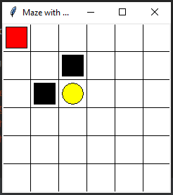

# Maze Problem

# Problem Definition
 This project is a simulation of a maze problem in that there is an agent which was located in the top-right
 corner of the environment. Furthermore, there are two holes at the maze environment that they cover the objective.

# Environment
Maze environment has a method to return state reward based on each action (a)

## States
 tiles (6*6) (two black holse) (agent start from most top-right cell and agent would avoid holes)
## Actions
 Agent can move in 4 directions: (**L**)eft, (**R**)ight, (**U**)p, (**D**)ow, therefore actions consist of [L, R, U, D]
## Reward
 +1 for gold hole (objective), -1 for black holes, 0 for the rest states

# Agent
Agent has two methods:
 1- choose_action to choose action based on state (s)
 2- learn based on (s: current state, a: current action, r: current reward, s_: next state)

# App
App.py handle the interactions between agent and perform action on the environment and then get reward and then choose new action
App use Agent and Environment that represented agent and environment respectively.
